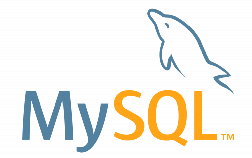
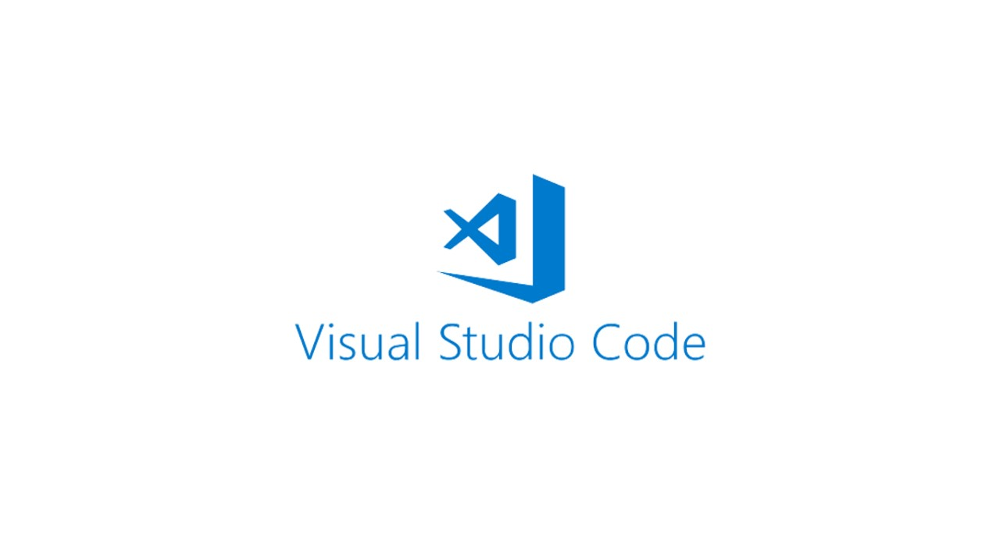
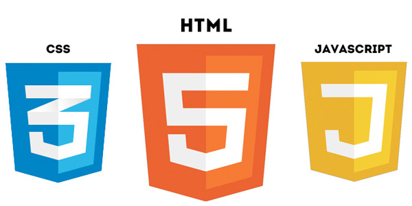

# MySQL

* MySQL é um sistema de gerenciamento de banco de dados relacional (SGBDR) muito popular e amplamente utilizado. Ele é conhecido por ser de código aberto e por oferecer uma plataforma robusta para armazenamento e gerenciamento de dados. Algumas características principais do MySQL incluem:

  **Relacional**: Organiza os dados em tabelas com linhas e colunas, seguindo o modelo relacional.

  **Multiplataforma**: Funciona em diversas plataformas como Linux, Windows, macOS, etc.

  **Velocidade e desempenho**: É conhecido por ser rápido e eficiente no processamento de consultas e transações.

  **Segurança**: Oferece recursos avançados de segurança para proteger os dados armazenados.

  **Extensibilidade**: Suporta extensões e plugins que permitem adicionar funcionalidades extras conforme necessário.

  **Escabilidade**: Pode lidar com grandes volumes de dados e muitos usuários simultaneamente.

  MySQL é amplamente utilizado em aplicações web, sendo especialmente popular em combinação com linguagens de programação como PHP, Python, Java, entre outras. Ele é utilizado por muitos sites e aplicativos para armazenar e gerenciar dados de forma eficiente e segura.

 

---
# Node.js

* Node.js é um ambiente de tempo de execução JavaScript baseado no motor V8 do Google Chrome. Ele permite que você execute código JavaScript fora do navegador, ou seja, no servidor. Aqui estão algumas características principais do Node.js:

1. **JavaScript no lado do servidor**: Node.js permite que você desenvolva aplicativos do lado do servidor usando JavaScript, o que facilita a criação de aplicações web completas utilizando a mesma linguagem em ambos os lados (cliente e servidor).

2. **Assíncrono e baseado em eventos**: Node.js é conhecido por sua capacidade de lidar com operações de forma assíncrona e baseada em eventos. Isso significa que ele pode lidar com muitas conexões simultâneas sem bloquear o fluxo do programa, o que o torna eficiente em aplicações que precisam de alta escalabilidade e tempo de resposta rápido.

3. **Módulos e NPM**: Node.js possui um sistema de módulos que permite dividir o código em partes reutilizáveis. O NPM (Node Package Manager) é o gerenciador de pacotes do Node.js, que oferece acesso a milhares de bibliotecas de código aberto para acelerar o desenvolvimento.

4. **Desenvolvimento de API**: Node.js é amplamente utilizado para criar APIs (Interfaces de Programação de Aplicativos) RESTful e GraphQL, devido à sua capacidade de lidar com solicitações HTTP de forma eficiente.

5. **Aplicações em tempo real**: É frequentemente usado para aplicações em tempo real como chats, jogos online e sistemas de colaboração, devido à sua capacidade de manter conexões persistentes e bidirecionais com os clientes.

6. **Comunidade e suporte**: Node.js possui uma comunidade ativa e uma grande quantidade de recursos educacionais, o que facilita o aprendizado e a resolução de problemas.

 Node.js se tornou uma escolha popular para desenvolvedores devido à sua eficiência, escalabilidade e flexibilidade. É amplamente adotado por empresas de todos os tamanhos, desde startups até grandes corporações, para construir uma variedade de aplicações web e serviços.

---
 # Visual Studio Code

* Visual Studio Code (VS Code) é um editor de código-fonte desenvolvido pela Microsoft que se destaca por sua leveza, velocidade e extensibilidade. Aqui estão algumas características principais do Visual Studio Code:

1. **Gratuito e de Código Aberto**: O VS Code é gratuito para download e possui seu código-fonte disponível publicamente no GitHub, o que permite que a comunidade contribua para seu desenvolvimento e melhoria contínua.

2. **Multiplataforma**: Está disponível para Windows, macOS e Linux, oferecendo uma experiência consistente em diferentes sistemas operacionais.

3. **Interface Limpa e Personalizável**: Possui uma interface de usuário minimalista que pode ser facilmente personalizada com temas, ícones e configurações para se adequar às preferências do desenvolvedor.

4. **Suporte Extensivo para Linguagens e Frameworks**: O VS Code suporta uma ampla gama de linguagens de programação, incluindo JavaScript, TypeScript, Python, Java, C#, entre outras. Além disso, oferece suporte para diversos frameworks e tecnologias como React, Angular, Vue.js, Node.js, Docker, etc.

5. **Integração com Git e Controle de Versão**: Integra ferramentas de controle de versão como Git diretamente na interface do usuário, facilitando o gerenciamento de repositórios e o controle de versão de código-fonte.

6. **Depuração Integrada**: Oferece suporte para depuração de aplicações diretamente no editor, permitindo aos desenvolvedores definir breakpoints, inspecionar variáveis e analisar o fluxo de execução do código.

7. **Extensões e Ecossistema**: O VS Code possui um sistema de extensões robusto que permite aos desenvolvedores adicionar funcionalidades adicionais ao editor. Existem milhares de extensões disponíveis no marketplace que podem ser instaladas com facilidade para melhorar o fluxo de trabalho e a produtividade.

8. **Terminal Integrado**: Inclui um terminal integrado que permite executar comandos diretamente no contexto do projeto em que você está trabalhando, eliminando a necessidade de alternar entre janelas ou aplicativos externos.

O Visual Studio Code é amplamente adotado pela comunidade de desenvolvedores devido à sua combinação de funcionalidades avançadas, simplicidade de uso e suporte ativo da comunidade e da Microsoft. Ele se tornou uma escolha popular para desenvolvimento de software em diversas plataformas e linguagens de programação.

---
# Front-End : HTML , Java Script e CSS

* 

### HTML (HyperText Markup Language)

HTML é a linguagem padrão para criar e estruturar conteúdo na web. Ele define a estrutura básica de uma página web usando elementos como tags, atributos e textos. Aqui estão algumas características principais do HTML:

1. **Estruturação de Conteúdo**: HTML permite criar seções, como cabeçalhos, parágrafos, listas, tabelas, formulários, etc., que organizam e descrevem o conteúdo da página.

2. **Semântica**: Oferece uma série de elementos semânticos (como `<header>`, `<footer>`, `<article>`, `<section>`, etc.) que descrevem o significado do conteúdo, melhorando a acessibilidade e a indexação pelos motores de busca.

3. **Markup Simples**: Utiliza uma sintaxe simples baseada em tags para envolver e definir o conteúdo, como `<tag></tag>`.

4. **Integração com Outras Tecnologias**: Pode incorporar elementos de mídia, scripts JavaScript e estilos CSS para enriquecer a experiência do usuário.

### JavaScript

JavaScript é uma linguagem de programação fundamental para o desenvolvimento web front-end. Aqui estão suas características principais:

1. **Linguagem de Programação Client-Side**: JavaScript é executado no navegador do usuário, permitindo a criação de interações dinâmicas e responsivas na página web.

2. **Interatividade**: É utilizado para adicionar comportamentos como validação de formulários, animações, manipulação do DOM (Document Object Model), requisições assíncronas (AJAX), entre outros.

3. **ECMAScript**: A especificação padrão é definida pela ECMAScript, que evoluiu ao longo do tempo para incluir novos recursos e melhorar a eficiência da linguagem.

4. **Frameworks e Bibliotecas**: Existem muitos frameworks e bibliotecas JavaScript populares como React, Angular, Vue.js, jQuery, entre outros, que simplificam o desenvolvimento de aplicações complexas.

### CSS (Cascading Style Sheets)

CSS é a linguagem utilizada para estilizar e designar a apresentação dos elementos HTML na página web. Aqui estão algumas características principais do CSS:

1. **Estilo e Layout**: Define como os elementos HTML são exibidos na tela, controlando aspectos como cores, fontes, espaçamentos, alinhamentos, tamanhos e disposições.

2. **Seletor e Propriedades**: Utiliza seletores para aplicar estilos a elementos específicos e propriedades para definir como esses estilos devem ser aplicados.

3. **Flexibilidade**: Suporta várias técnicas de layout, como flexbox e grid, que permitem criar layouts responsivos e adaptáveis.

4. **Cascata e Herança**: O termo "cascading" em CSS refere-se à forma como múltiplas regras de estilo são aplicadas e priorizadas, permitindo um controle granular sobre o design da página.

5. **Media Queries**: Permite aplicar estilos diferentes com base nas características do dispositivo, como tamanho da tela, densidade de pixels, orientação, etc., para garantir uma experiência de usuário consistente em diferentes dispositivos.

### Conclusão

HTML, JavaScript e CSS são as pedras angulares do desenvolvimento front-end web. Juntas, essas tecnologias permitem criar páginas web interativas, estilizadas e responsivas que proporcionam uma experiência rica e intuitiva aos usuários. O constante avanço e a evolução dessas linguagens e suas especificações garantem que desenvolvedores possam criar interfaces modernas e funcionais para uma ampla gama de dispositivos e plataformas.

---
# POSTMAN

* Postman é uma ferramenta popular utilizada principalmente por desenvolvedores para testar APIs (Interfaces de Programação de Aplicações). Ele fornece uma interface gráfica amigável que permite aos usuários enviar requisições HTTP para um servidor web e visualizar as respostas. Aqui estão as principais características e funcionalidades do Postman:

1. **Ambiente de Desenvolvimento de API**: O Postman é projetado para facilitar o desenvolvimento e a colaboração em torno de APIs. Ele permite que os desenvolvedores criem, teste e documentem APIs de forma eficiente.

2. **Interface Intuitiva**: Possui uma interface de usuário limpa e intuitiva que facilita a construção de requisições HTTP complexas. Os desenvolvedores podem criar solicitações GET, POST, PUT, DELETE, entre outras, e personalizar headers, parâmetros, body da requisição, etc.

3. **Coleções de Requisições**: As coleções são conjuntos organizados de requisições HTTP relacionadas. Elas permitem agrupar requisições por funcionalidade ou endpoint, facilitando o gerenciamento e a execução de testes automatizados.

4. **Ambientes e Variáveis**: O Postman suporta o uso de ambientes e variáveis, o que é útil para testar diferentes configurações, como ambientes de desenvolvimento, produção, etc. Isso permite que os desenvolvedores alterem dinamicamente valores como URLs de API, tokens de autenticação, entre outros, sem modificar manualmente cada requisição.

5. **Testes Automatizados**: Permite a criação de scripts de testes automatizados usando JavaScript (com base na biblioteca de testes Mocha). Os testes podem ser definidos para verificar se a API retorna os resultados esperados, garantindo a integridade funcional da aplicação.

6. **Documentação de API**: O Postman pode gerar documentação automática com base nas requisições e respostas configuradas. Isso facilita a compreensão da API por parte dos desenvolvedores e usuários finais, mostrando detalhes como endpoints disponíveis, parâmetros aceitos, formatos de resposta, etc.

7. **Colaboração e Compartilhamento**: Os desenvolvedores podem compartilhar coleções de requisições, ambientes e documentação de API com colegas de equipe ou com a comunidade, facilitando a colaboração e o feedback.

8. **Monitoramento de API**: O Postman oferece recursos avançados para monitorar e testar a disponibilidade e o desempenho de APIs em produção, ajudando a identificar problemas de integração ou performance.

Em resumo, o Postman é uma ferramenta essencial para desenvolvedores que trabalham com APIs, fornecendo uma maneira fácil e eficiente de criar, testar, documentar e colaborar em torno de interfaces de programação de aplicações de forma rápida e eficaz.

---
# SQL 

* SQL, ou Structured Query Language, é uma linguagem padrão para gerenciamento de bancos de dados relacionais (RDBMS). Criado inicialmente pela IBM nos anos 70, o SQL se tornou a linguagem de consulta predominante para a maioria dos sistemas de banco de dados comerciais. Aqui estão as principais características e funcionalidades do SQL:

### Características Principais do SQL:

1. **Linguagem Declarativa**: SQL é uma linguagem declarativa, o que significa que você especifica o que deseja realizar sem necessariamente indicar como fazê-lo. Em contraste com linguagens procedurais, como Java ou Python, onde você define passo a passo as operações, no SQL você descreve os dados que deseja obter ou manipular.

2. **Operações Básicas**: SQL suporta operações básicas para manipular dados em um banco de dados:
   - **SELECT**: Recupera dados de uma ou mais tabelas.
   - **INSERT**: Insere novos dados em uma tabela.
   - **UPDATE**: Modifica os dados existentes em uma tabela.
   - **DELETE**: Remove dados de uma tabela.
   
3. **Criação e Manipulação de Tabelas**: SQL permite a criação, alteração e exclusão de tabelas dentro de um banco de dados. As tabelas são estruturadas em colunas (campos) e linhas (registros), organizadas de acordo com um esquema específico definido pelo desenvolvedor.

4. **Restrições e Integridade de Dados**: SQL oferece mecanismos para aplicar restrições de integridade nos dados armazenados no banco de dados. Isso inclui chaves primárias, chaves estrangeiras, restrições de unicidade, entre outros, que garantem a consistência e a precisão dos dados.

5. **Consultas Complexas**: Além das operações básicas, SQL permite realizar consultas complexas e análises de dados usando cláusulas como JOIN (para combinar dados de múltiplas tabelas), GROUP BY (para agrupar dados com base em critérios específicos), HAVING (para aplicar condições a grupos de dados), entre outras.

6. **Funções e Procedimentos**: SQL suporta funções e procedimentos armazenados, que são blocos de código reutilizáveis que podem ser chamados para realizar tarefas específicas dentro do banco de dados. Isso promove a reutilização de código e a simplificação de tarefas complexas.

7. **Transações**: SQL suporta transações, que são unidades de trabalho que garantem a atomicidade, consistência, isolamento e durabilidade (conhecidas como as propriedades ACID) das operações realizadas no banco de dados. Isso garante que as operações sejam executadas com precisão e integridade, mesmo em ambientes de múltiplos usuários.

### Utilização do SQL:

- **Bancos de Dados Relacionais**: SQL é amplamente utilizado em sistemas de gerenciamento de bancos de dados relacionais como MySQL, PostgreSQL, Oracle Database, SQL Server, SQLite, entre outros.
  
- **Aplicações Web e Empresariais**: É a base para a maioria das aplicações web e empresariais que necessitam de armazenamento estruturado e gerenciamento de grandes volumes de dados.

- **Análise de Dados**: SQL é essencial para consultas complexas e análises de dados em data warehouses e sistemas de business intelligence (BI), onde a manipulação e agregação de grandes conjuntos de dados são comuns.

- **Administração de Dados**: Administradores de bancos de dados (DBAs) utilizam SQL para gerenciar e otimizar o desempenho dos bancos de dados, criar índices, definir permissões de acesso, entre outras tarefas.

Em resumo, SQL desempenha um papel fundamental no armazenamento, manipulação e análise de dados em sistemas de banco de dados relacionais, sendo uma habilidade essencial para desenvolvedores de software, analistas de dados e administradores de sistemas.